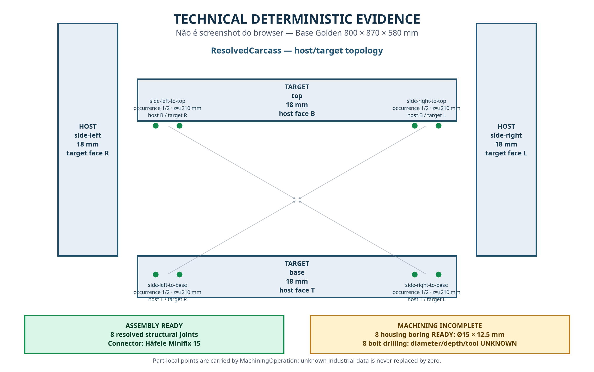

# Stage 13 — Verified Structural Carcass Joinery

> **STATUS: BLOCKED** — A implementação e validação local passaram, mas o encerramento Git obrigatório está bloqueado porque o push para `origin/main` falhou por credencial GitHub inválida. Stage 13 não é declarada PASS. Não foi iniciado Stage 14, nova família industrial ou CAM/CNC.

## 1. Baseline e escopo

A baseline herdada da Stage 12.1 possuía **0 diagnósticos TypeScript, 644 testes Vitest e build de produção PASS**. A Stage 13 foi executada sobre essa baseline para adicionar somente um piloto industrial de connector estrutural, mantendo a separação profissional/LEGACY e as regras de verdade de fabricação da Stage 12.1.

O escopo final é um único sistema **Häfele Minifix 15** para a carcaça externa de `kitchen-base-2-doors` e `kitchen-drawer-3`. Não houve segunda variante, nova família, CAM, CNC, G-code, alteração de kernel geométrico ou migração Supabase.

## 2. Auditoria estrutural

A auditoria comparou `ResolvedCarcass`, `ConstructionProfileRegistry`, os builders reais e os relatórios downstream. A topologia aceita é declarada por `StructuralJoineryRule`, resolvida por `resolveStructuralJoinery()` e aplicada por `structuralJoineryApplication.ts`. O resolver puro não consulta store, React, UI, renderer ou Supabase.

A regra do Dioris declara quatro relações lógicas e uma policy simétrica front/rear: `side-left-to-base`, `side-right-to-base`, `side-left-to-top` e `side-right-to-top`. A policy é **FAMILY_APPLICATION_RULE**, não dado do fabricante. Cada relação gera duas ocorrências, totalizando oito joints e oito connectors comprados.

## 3. Fontes oficiais e referências abertas

A identidade e os dados industriais foram separados da regra de aplicação. A fonte oficial da Häfele identifica o alojamento Minifix 15 e disponibiliza CAD/documentação técnica no fluxo de produto [1]. A página oficial do connecting bolt identifica o sistema de parafuso torneado e disponibiliza documentação técnica [2].

As referências abertas foram usadas somente como comparação arquitetural. `WoodworkingShop` foi revisado como planner paramétrico client-side com cut-list, BOM, nesting e engine TypeScript puro [3]. `cabinetry` foi revisado como representação geométrica e estimativa de materiais, explicitamente não como norma industrial [4]. Nenhum valor de connector foi derivado desses projetos.

## 4. Connector escolhido

| Campo | Valor | Origem |
|---|---|---|
| Manufacturer | Häfele | ManufacturerSpec oficial |
| Family/model | Minifix 15 connector housing + turned connecting bolt system | Häfele |
| Hardware ID | `structural-minifix-15` | Dioris registry |
| Variant ID | `hafele-minifix15-p00861332` | Dioris registry |
| Manufacturer code | `P-00861332 / P-00861784` | Häfele product pages |
| Housing diameter | 15 mm | ManufacturerSpec |
| Housing depth | 12.5 mm, tolerance +0.5 mm | ManufacturerSpec |
| Minimum panel thickness | 16 mm | ManufacturerSpec |
| Housing reference from edge | 8 mm | ManufacturerSpec |
| Connecting-bolt drilling distance | 24 mm | ManufacturerSpec |
| Connecting-bolt thread length | 15 mm | ManufacturerSpec |
| Target-hole diameter/depth/tool | UNKNOWN | Não publicado na fonte selecionada |

O connector foi escolhido porque a fonte oficial fornece identidade, variante e dados suficientes para o housing. O target bolt permanece deliberadamente `INCOMPLETE` quando diâmetro, profundidade ou ferramenta não estão comprovados. O sistema não transforma screw/thread data em pilot-hole data.

## 5. ManufacturerSpec versus ApplicationRule

`HardwareDefinition` e `HardwareManufacturingVariant` foram mantidos separados no `HardwareRegistry`. A `ManufacturerSpec` contém somente fatos do fabricante. As regras `GOLDEN_BASE_STRUCTURAL_JOINERY_RULE` e `GOLDEN_DRAWER_STRUCTURAL_JOINERY_RULE` possuem IDs distintos, ownership explícito por `moduleDefinitionId`, policy `symmetric-pair`, quantity policy `front-rear-pair`, assembly `detachable` e machining policy `manufacturer-data-only`.

O `ConstructionProfileRegistry` valida que uma regra estrutural pertence ao mesmo módulo do profile. Atribuir a rule do Base ao Upper é rejeitado por ownership mismatch. O Upper não recebe cópia silenciosa do Base.

## 6. ResolvedStructuralJoinery

Cada joint resolvido carrega `id`, `instanceId`, `moduleDefinitionId`, `ruleId`, `connectorHardwareId`, `manufacturingVariantId`, `hostPartId`, `targetPartId`, `hostFace`, `targetFace`, `jointAxis`, posição semântica, coordenada part-local, quantidade/índice, `assemblyStatus`, `machiningStatus`, `unknownParameters`, diagnostics e provenance.

Os IDs são determinísticos e independentes da posição global. O `relationId` permanece estável durante rebuild e nos ciclos A→B→A. O resolver valida identidade das peças, faces de contato, espessura mínima de 16 mm, profundidade mínima da policy, bounds e separação front/rear.

## 7. Topologia dos Goldens

| Golden | Dimensões | Structural rule | Resultado |
|---|---:|---|---|
| Base | 800 × 870 × 580 mm | Regra própria do Base | 8 joints, assembly READY |
| Drawer | 800 × 870 × 580 mm | Regra própria do Drawer; mesma ManufacturerSpec | 8 joints, sem tocar drawer-box/MOVENTO |
| Upper | 800 × 700 × 350 mm | `undefined` | INCOMPLETE honesto, sem Minifix |

No Base, somente side-left/side-right com base/top participam da regra. Back 6 mm, shelf removível e toe-kick possuem boundaries próprias. O Drawer reutiliza a ManufacturerSpec, mas não a ApplicationRule do Base e não aplica connector em drawer fronts, drawer boxes ou runners. O Upper permanece sem regra aprovada.

## 8. Back, shelf e toe-kick boundaries

O Joinery Report profissional agora apresenta `back-attachment = INCOMPLETE` com `backAttachmentRule` ausente, `shelf-attachment = INCOMPLETE` com `shelfAttachmentRule` ausente e `toe-kick-structural-boundary = NOT_REQUIRED`. Nenhum desses elementos recebe automaticamente o connector estrutural de painel 18 mm.

## 9. Joinery Report e isolamento LEGACY

O caminho profissional consome `ResolvedStructuralJoinery` e não chama `legacyBuildJoineryOperations()` para preencher joints. Quando uma rule profissional está ausente, o resultado é `INCOMPLETE` e não confirmat+dowel. O adapter LEGACY continua disponível somente para módulos LEGACY.

## 10. Assembly readiness

Para cada joint, a relação entre host e target, o connector, a variante, as faces e a policy de montagem estão comprovados. Portanto, as oito relações do Base e do Drawer são **ASSEMBLY READY**. Assembly readiness é independente da suficiência da furação.

## 11. Machining readiness

A conversão para machining gera operações separadas por processo e peça. O housing boring é gerado somente quando os dados publicados estão completos: oito operações `minifix-head`, face part-local correta, diâmetro 15 mm e profundidade 12.5 mm, status **READY**. O bolt drilling é representado separadamente como oito operações `minifix-body`, status **INCOMPLETE**, com diameter/depth/tool em `unknownParameters` e nunca como zero.

Todos os `MachiningOperation` usam coordenadas part-local. Application offset e module-local position não são confundidos com a coordenada de usinagem. Assembly não é convertido em drilling e hardware visual não é convertido em machining.

## 12. BOM, fabrication report, cut-list e nesting

A BOM registra o Minifix como `PURCHASED_HARDWARE`, com manufacturer, family/model, variant, manufacturer code, quantidade oito, associação de instância e oito `jointIds`. O connector não aparece na cut-list. A cut-list permanece somente com peças físicas/MDF; o nesting continua operando apenas sobre peças cortáveis. A reconstrução A→B→A e save/reload não duplicam hardware.

## 13. Matrices e invariâncias

A acceptance cobre width matrix integrada para 800/900/1000 mm e valores aceitos pelo ModuleDefinition, depth matrix integrada para profundidades permitidas, height matrix pura em 700/870/1000 mm, bounds, policy collision e thickness inválida. A topologia não muda arbitrariamente por altura; profundidade estreita que viola o clear span resulta em `INVALID`.

Os ciclos A→B→A de width e depth preservam joint IDs, relation IDs, hardware, BOM, machining, cut-list e nesting. Move/rotation preservam topologia e coordenadas part-local. Multi-instance mantém IDs, hardware, peças e machining isolados. Persistence/reload reconstroi os mesmos reports a partir de referências/configuração, sem serializar o resultado resolvido.

## 14. Acceptance e mutation proof

A suíte `stage13StructuralJoineryAcceptance.test.ts` possui **10 testes** e cobre contract, manufacturer provenance, registry ownership, Base, Drawer, Upper, boundaries, matrices, thickness, depth collision, stable IDs, BOM, fabrication, machining readiness, unknowns, cycles, move/rotation, multi-instance, persistence e isolation.

O harness `scripts/stage13_mutation_checks.sh` executa oito locks dirigidos. Todos retornaram `PASS_EXPECTED_FAILURE`: remover rule do Base, trocar connector, remover relation, alterar diâmetro, marcar machining incompleto como READY, remover unknowns, trocar source e reintroduzir LEGACY no professional path.

## 15. Regressões obrigatórias

Foram executadas as suítes Stage 9 Registry/Parity, Stage 9.2 Hardware Boundary, Stage 10 Drawer Foundation/Acceptance, Stage 11 MOVENTO Foundation/Acceptance, Stage 12 Closure, Stage 12.1 Professional Dispatch/Truth e os Golden manufacturing/machining contracts. A regressão obrigatória passou sem falhas.

## 16. Validação final

| Verificação | Resultado | Evidência |
|---|---|---|
| TypeScript | PASS — 0 diagnósticos | `evidence/stage13-structural-joinery/01-typecheck.log` |
| Vitest | PASS — 63 arquivos / 654 testes | `02-vitest.log` |
| Production build | PASS | `03-build.log` |
| `git diff --check` | PASS | `04-diff-check.log` |
| Mutations | PASS — 8/8 expected failures | `mutations/20-mutation-summary.md` |
| Regressões obrigatórias | PASS | `05-required-regressions.log` |
| Evidência técnica | PASS — diagrama determinístico | `STAGE_13_STRUCTURAL_JOINERY_TECHNICAL.png` |

### Evidência visual técnica

A figura abaixo é uma representação determinística de engenharia, não um screenshot de browser. Ela mostra a carcaça Base, host/target, faces, relações, posições front/rear e a separação entre housing boring READY e bolt drilling INCOMPLETE.

## 17. Git

O commit de implementação é `605710b` (`feat(planner-v2): add verified structural carcass joinery`). A correção complementar de boundaries é `142ceb6` (`fix(planner-v2): enforce structural attachment boundaries`). O push obrigatório para `origin/main` foi tentado e falhou com `Invalid username or token`; a rota HTTPS e a alternativa SSH também não autenticaram. A prova está em `90-git-push-proof.log` e `91-final-git-status.log`. O HEAD documental local final é `0e84d21`; a validação desse estado está em `97-final-head-typecheck.log`, `98-final-head-vitest.log`, `99-final-head-build.log`, `100-final-head-diff-check.log` e `101-final-head-validation-summary.txt`. Git push, paridade local/remota e encerramento limpo permanecem BLOCKED até reautenticação.

## 18. Supabase

**SUPABASE = NOT APPLICABLE.** A Stage 13 não alterou `supabase/`, `db/`, `migrations/`, `functions/`, RLS, policies, storage, schema ou seed. Não foi criada migration vazia, não foi executado `supabase db push` e não houve alteração destrutiva. A auditoria está em `80-supabase-audit.log`.

## 19. Status matrix

| Item | Status | Evidence |
|---|---|---|
| Baseline | PASS | `00-validation-summary.txt` |
| Structural audit | PASS | Este relatório; source files |
| Official connector provenance | PASS | `07-external-sources.md`, HardwareRegistry |
| ManufacturerSpec | PASS | HardwareRegistry, StructuralJoinery |
| StructuralJoineryRule | PASS | structuralJoineryRules.ts |
| ConstructionProfile integration | PASS | constructionProfiles.ts |
| Registry ownership | PASS | acceptance test |
| ResolvedStructuralJoinery | PASS | resolver + acceptance |
| Base joints | PASS | acceptance |
| Drawer joints | PASS | acceptance |
| Upper decision | PASS — INCOMPLETE honesto | acceptance |
| Back boundary | PASS — INCOMPLETE | acceptance |
| Shelf boundary | PASS — INCOMPLETE | acceptance |
| Toe-kick boundary | PASS — NOT_REQUIRED | acceptance |
| Stable joint IDs | PASS | acceptance |
| Connector BOM | PASS | fabricationReport + acceptance |
| Cut-list separation | PASS | acceptance |
| Machining generation | PASS | machiningReport + acceptance |
| Part-local coordinates | PASS | acceptance |
| Assembly readiness | PASS | acceptance |
| Machining readiness | PASS — READY/INCOMPLETE split | acceptance |
| No zero-as-unknown | PASS | acceptance + mutation |
| Width/depth/height matrices | PASS | acceptance |
| A→B→A / depth cycle | PASS | acceptance |
| Move/rotation invariance | PASS | acceptance |
| Multi-instance isolation | PASS | acceptance |
| Save/reload | PASS | acceptance |
| LEGACY isolation | PASS | Stage 12.1 + mutation |
| Source lock | PASS | acceptance + mutation |
| Mutations | PASS — 8/8 | mutation summary |
| Stage 9 / 9.2 / 10 / 11 / 12 / 12.1 regression | PASS | required regression log |
| TypeScript | PASS | typecheck log |
| Vitest | PASS | Vitest log |
| Production build | PASS | build log |
| git diff --check | PASS | diff log |
| Git commit | PASS — local `0e84d21` | Git proof |
| Git push | BLOCKED — GitHub credential invalid | Git proof |
| Local HEAD = Remote HEAD | BLOCKED — remote parity unavailable | Git proof |
| Final Git status | BLOCKED — final clean state awaits evidence commit/push | Git proof |
| Supabase audit | NOT APPLICABLE | `80-supabase-audit.log` |

## 20. Respostas obrigatórias de aprovação

> **Qual é a relação?** Cada `relationId` declara a relação lateral-base ou lateral-top.
>
> **Qual é o host e o target?** Cada joint carrega `hostPartId`, `targetPartId`, `hostFace` e `targetFace`.
>
> **Qual connector e variante?** `structural-minifix-15` / `hafele-minifix15-p00861332`, com códigos oficiais P-00861332 / P-00861784.
>
> **Qual dado vem do fabricante?** Identidade Minifix 15, diâmetro do housing, profundidade, tolerância, espessura mínima, referência de borda e dados publicados do bolt.
>
> **Qual dado é regra do Dioris?** Topologia Base/Drawer, ownership, policy simétrica front/rear, quantidade e offsets de aplicação.
>
> **Qual é a posição?** Cada ocorrência possui position semantics front/rear e coordenadas determinísticas part-local.
>
> **Assembly está READY?** Sim, para as oito relações Base/Drawer.
>
> **Machining está READY ou INCOMPLETE?** Housing boring está READY; bolt drilling está INCOMPLETE.
>
> **Se INCOMPLETE, o que falta?** Diâmetro, profundidade e ferramenta do target bolt hole, que não foram comprovados pela fonte selecionada.
>
> **Qual item aparece na BOM?** O connector aparece como `PURCHASED_HARDWARE`; não aparece na cut-list.

## 21. Encerramento

A implementação local Stage 13 está tecnicamente validada, mas o estado de encerramento é **BLOCKED** pela falha de autenticação GitHub. Conforme a missão, não declarar PASS. O trabalho para aqui sem iniciar Stage 14, nova família, CAM/CNC/G-code. O pacote local inclui código alterado, testes, mutation script, logs, auditoria, relatório Markdown, PDF, evidência técnica, prova da falha Git e auditoria Supabase.

## Referências

[1]: https://www.hafele.com/us/en/product/connector-housing-minifix-15/P-00861332/ "Häfele — Connector Housing, Minifix 15"
[2]: https://www.hafele.com/us/en/product/connecting-bolt-turned-minifix-system/P-00861784/ "Häfele — Connecting Bolt, Minifix System"
[3]: https://github.com/RajwanYair/WoodworkingShop "RajwanYair/WoodworkingShop — open-source cabinet planner"
[4]: https://github.com/FickleHobbyist/cabinetry "FickleHobbyist/cabinetry — open-source cabinetry geometry reference"
